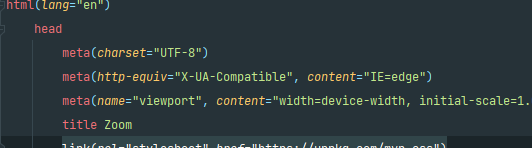
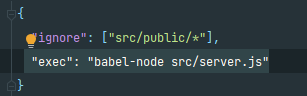
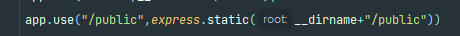

# Zoom Clone Coding

Zoom Clone using NodeJs,WebRTC AND Websockets (javaScript)

#### MVP CSS 사용법

  
#### Nodemon : 프로젝트를 살펴고 변경사항 있을시 서버를 재시작해주는 프로그램 ( 서버 재시작 대신 아래 이미지 컴파일)

  
#### public 폴더를 유저에게 공개

#### 

[comment]: <> (https://nomadcoders.co/noom/lectures/3072)
