# Zoom Clone Coding

Zoom Clone using NodeJs,WebRTC AND Websockets (javaScript)

#### MVP CSS 사용법

#### Nodemon : 프로젝트를 살펴고 변경사항 있을시 서버를 재시작해주는 프로그램 ( 서버 재시작 대신 아래 이미지 컴파일)

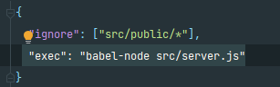

#### public 폴더를 유저에게 공개

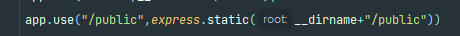

####         

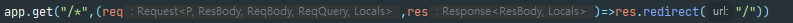

## WEBSOCKETS

- HTTP VS WebSocket ( 서버가 사용자 기억이 가능 )   
  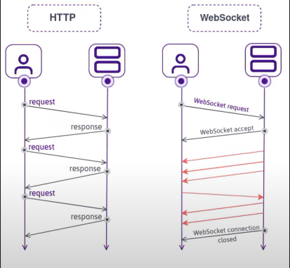   
- WebSocket Messages (back-end)   
  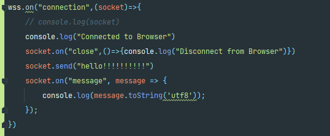   
- 다른 브라우저에서 (크롬, 엣지 등등) socket 전송위한 소스 (forEach) 
  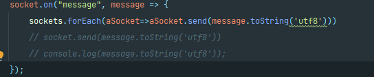   
- 백엔드에서는 다양한 프로그래밍언어 사용 자바스크립트 object 보내면 안됨 (문자열로 변경)    
  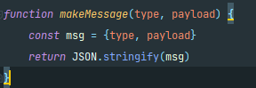   
- socket안에 정보를 저장 할 수있다 object이기 때문  
  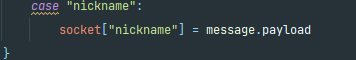

## Socket.IO

- socket.on 받는거 / socket.emit 보내는느낌
- Socket.io는 webSocket 의부가기능이 아니며, socketIo는 가끔 webSocket 사용하는 FrameWork
- Socket.io는 webSocket + 다른것도 사용
- webSocket은 object 전송 x , string 변환시키고 string 전송
- socket.io는 어떤 event도 전송가능 / object 전송가능 / 서버에서 호출하는 function이 들어갈수있음 (callback함수)
- back-end에서 function을 호출 하지만 fuction은 front-end에서 실행됨  
  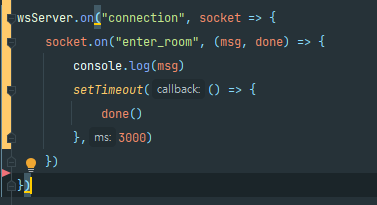   
- socket.IO는 room.id를 제공(join을 통한 room 접속가능 )  
  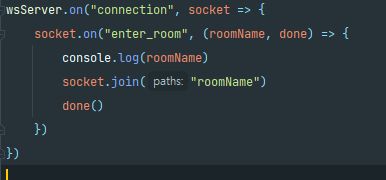   
- 서버와 프론트에서 주고 받는 방법  
  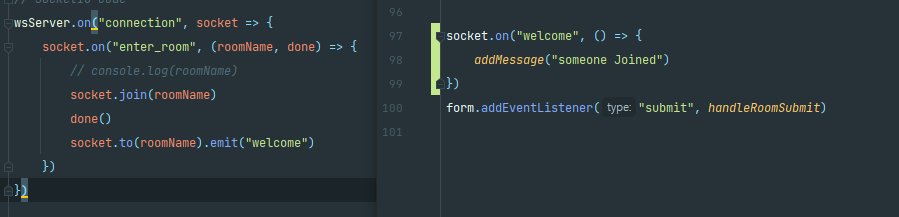   
- 소켓전체에 뿌려주기위한  
  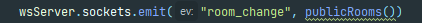   
- npm i @socket.io/admin-ui [admin-ui](https://admin.socket.io)  

## WebRTC

- javaScript 카메라 track 컨트롤
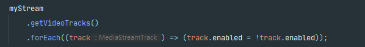   
- 카메라 옵션을 통한 정보 가져오기 
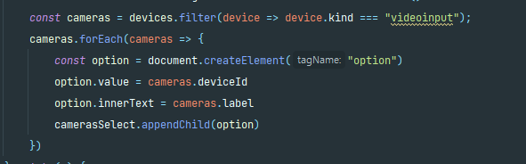
-   

  

### 라이브러리

[ws:Node.js WebSocket](https://www.npmjs.com/package/ws)  

- server.js socket : 연결된 브라우저
- front(app).js socket:  서버로의 연결

[comment]: <> (https://nomadcoders.co/noom/lectures/3077)

